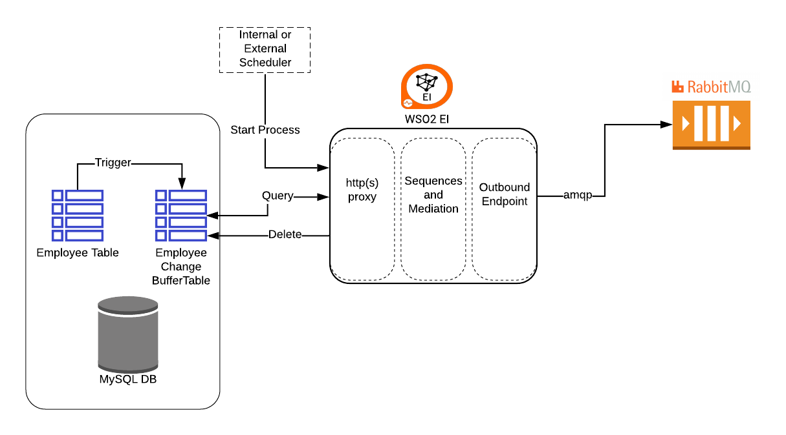

## Description
This part of the demo shows how to catch a change in a DB table and send a message to Rabbit MQ topic exchange

## Pre tasks
### Create Table and Trigger
1. Create the buffer table (NotifierEmployee)[(source)](createNotifierEmployee.sql) which contains the notification of the changes in the Employee table and is loaded by the triggers
2. Create the trigger *AfterEmployeeInsert* [(source)](insertTrigger.sql) and *AfterEmployeeUpdate* [(source)](updateTrigger.sql); the triggers insert a row in the NotifierEmployee table after an insert or update in the Employee table
3. Add 2 queries and 2 resource to the data service EmployeeDS in order to retrieve and delete the notification in the NotifierEmployee table;get here the [(updated version:)](EmployeeDS.xml).

## Demo
1. Create the [(NotifierEmployeeEP)](NotifierEmployeeEP.xml).
2. Create a new proxy Proxy Service [(EmployeeNotifierPollingProxy)](EmployeeNotifierPollingProxy.xml).
