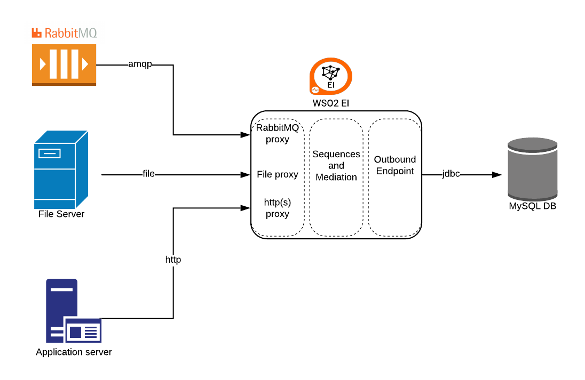

# DemoEI_File_RabbitMQ_DB
## Description
I this Demo the final goal is to show an integration between different sources (file, rabbitmq queue, service) to load data in a Database; the flow is able to detect whether a record is already existing and update it, or insert a new one
Input data is a Json file (Employee.json) and target is a table (Employees) in MySQL



## Prerequisites
RabbitMQ

MySQL

## Pre Tasks
### Configure MySQL
- create Database/schema: create schema Employees
- create Table Employees: create table Employees under schema Employees using *createEmployeesTable.sql*
- import mysql library in *<EI_HOME>lib* : *mysql-connector-java-5.1.42-bin.jar*
### Configure RabbitMQ
- import rabbitmq libraries in *<EI_HOME>lib* : *amqp-client-5.9.0.jar*
- configure RabbitMQ AMQP transport in *<EI_HOME>/conf/axis2/axis2.xml; for example:
```
<transportReceiver name="rabbitmq" class="org.apache.axis2.transport.rabbitmq.RabbitMQListener">
        <parameter name="AMQPConnectionFactory" locked="false">
            <parameter name="rabbitmq.server.host.name" locked="false">localhost</parameter>
            <parameter name="rabbitmq.server.port" locked="false">5672</parameter>
            <parameter name="rabbitmq.server.user.name" locked="false">guest</parameter>
            <parameter name="rabbitmq.server.password" locked="false">guest</parameter>
            <parameter name="rabbitmq.connection.retry.interval" locked="false">10000</parameter>
            <parameter name="rabbitmq.connection.retry.count" locked="false">5</parameter>
        </parameter>
    </transportReceiver>
...

<transportSender name="rabbitmq" class="org.apache.axis2.transport.rabbitmq.RabbitMQSender"/>
```
### Configure Files
- create the following folders, where *<FILE_HOME>* is the base location: *<FILE_HOME>/failure*, *<FILE_HOME>/in*, *<FILE_HOME>/done*

## Import or configure data services and sequences
### import (or create) data services in the EI: 
- EmployeeDS [(source)](supportingSeq&EP/EmployeeDS.xml); it includes resources to insert, update, or retreive Employee per EmployeeNumber.
### import supporting sequences in an Integration Studio project (create it):
- prepareQueryCall [(source)](supportingSeq&EP/prepareQueryCall.xml)
- postCall [(source)](supportingSeq&EP/postCall.xml)
### import or configure EP in the same Integration Studio project:
- GetEmployeeAddressEP (type: Address Enpoint) [(source)](supportingSeq&EP/GetEmployeeAddressEP.xml)
## Start the DEMO
### Open EI and show the Data Services created (eventually create it from scratch)
### Open Integration Studio and show the existing sequences and EPs
### Create a new sequence: InsertOrUpdateEmployee
#### Description of the sequence:
1. The sequence is meant to be used by all the different proxies
2. accepts Employee json message
3. performs a query (invoking EmployeeDS GET REST resource) to check whether the employee is in the DB already (using EmployeeNumber as key)
4. If it exists, an update is executed using the PUT resource, else an insert via POST
#### Steps of the sequence
1. Log the input message
```
<log level="full"/>
```
2. Add a property to get the EmployeeNumber:
```
<property description="getEmployeeNumber" expression="json-eval($.EmployeeData.EmployeeNumber)" name="EmployeeNumber" scope="default" type="STRING"/>
```
3. Invoke (and explain) the sequence *prepareQueryCall*
```
<sequence key="prepareQueryCall"/>
```
4. Invoke the *GetEmployeeAddressEP* endpoint to retrieve the Employee (if existing)
```
<call>
        <endpoint key="EmployeeEP"/>
</call>
```
5. Invoke the sequence *postCall*
```
<sequence key="postCall"/>
```
6. Add a switch mediator, with 2 cases:
```
<switch description="switchOnUpdateFlag" source="get-property('updateFlag')">
        <case regex="true">
        ....
        <case regex="false">
        <default/>
 </switch>
```
7. In the true branch (update case) add a property to set the PUT HTTP method and the PayloadFactory Mediator
```
<property description="set HTTP_METHOD" name="HTTP_METHOD" scope="axis2" type="STRING" value="PUT"/>
            <payloadFactory media-type="xml">
                <format>
                    <_putemployee xmlns="">
                        <EmployeeNumber>$1</EmployeeNumber>
                        <LastName>$2</LastName>
                        <FirstName>$3</FirstName>
                        <Email>$4</Email>
                        <Salary>$5</Salary>
                    </_putemployee>
                </format>
                <args>
                    <arg evaluator="xml" expression="get-property('EmployeeNumber')"/>
                    <arg evaluator="json" expression="$.EmployeeData.LastName"/>
                    <arg evaluator="json" expression="$.EmployeeData.FirstName"/>
                    <arg evaluator="json" expression="$.EmployeeData.email"/>
                    <arg evaluator="json" expression="$.SalaryData.AnnualGrossSalary"/>
                </args>
            </payloadFactory>
            <call>
                <endpoint key="EmployeeEP"/>
            </call>
```
8. In the false branch (insert case) add a property to set the POST HTTP method and the PayloadFactory Mediator, followed by a Call to the EmpployeeDS EP
```
           <property description="set HTTP_METHOD" name="HTTP_METHOD" scope="axis2" type="STRING" value="POST"/>
            <payloadFactory media-type="xml">
                <format>
                    <_postemployee xmlns="">
                        <EmployeeNumber>$1</EmployeeNumber>
                        <LastName>$2</LastName>
                        <FirstName>$3</FirstName>
                        <Email>$4</Email>
                        <Salary>$5</Salary>
                    </_postemployee>
                </format>
                <args>
                    <arg evaluator="xml" expression="get-property('EmployeeNumber')"/>
                    <arg evaluator="json" expression="$.EmployeeData.LastName"/>
                    <arg evaluator="json" expression="$.EmployeeData.FirstName"/>
                    <arg evaluator="json" expression="$.EmployeeData.email"/>
                    <arg evaluator="json" expression="$.SalaryData.AnnualGrossSalary"/>
                </args>
            </payloadFactory>
            <call>
                <endpoint key="EmployeeEP"/>
            </call>
```
